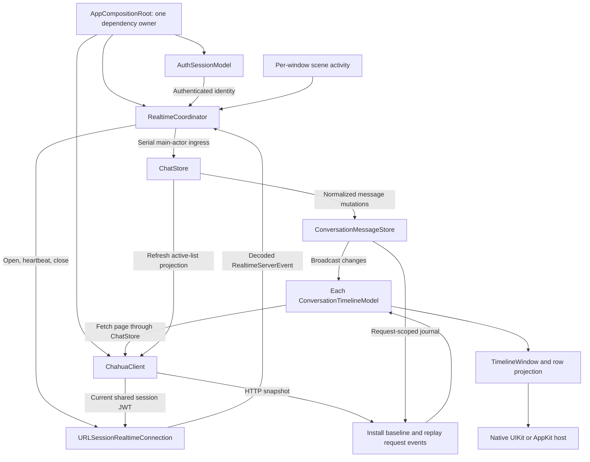
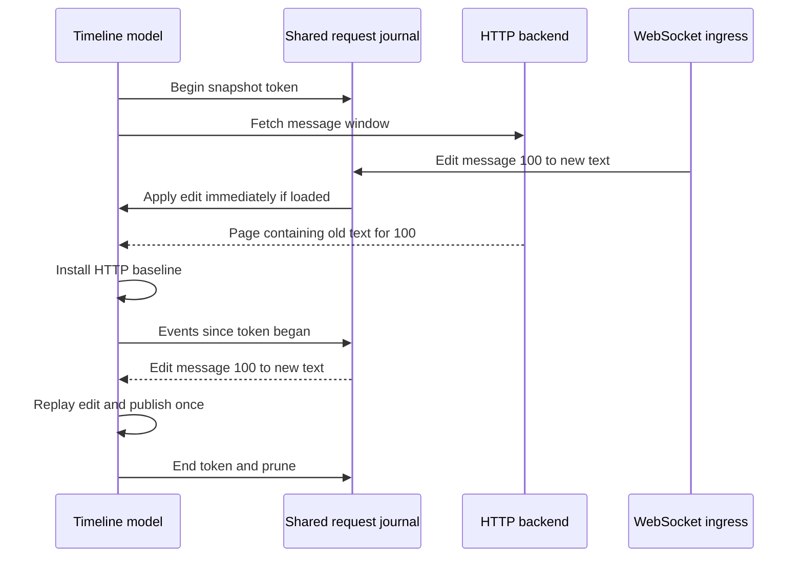

# Realtime messaging architecture

Status: implemented. Verified with package transport tests, macOS/iOS behavioral regressions, and real loopback WebSocket scenarios rendered through both native timeline hosts.

## Purpose and consistency model

The Apple client combines HTTP snapshots with WebSocket mutations. HTTP supplies chat-list projections and bounded message-history windows. WebSocket delivers immediate changes to those windows. Reconciliation combines both inputs before publishing timeline rows.

WebSocket is not a durable event stream. The backend has no event sequence, replay cursor, message revision, or deletion log. Its per-connection queue can silently drop an event. The client protects its own HTTP/event races, but cannot infer a global mutation order or guarantee lossless delivery. Fresh HTTP snapshots repair state on manual refresh, conversation open/reopen, and reconnect. There is no periodic reconciliation timer.

## Components and data flow

The diagram separates connection lifecycle, event routing, message reconciliation, and native rendering. The transport never changes a timeline directly. HTTP refresh work must not block the socket receive loop.

### Ownership and lifetime

| Component | Lifetime | Owns | Does not own |
|---|---|---|---|
| `AppCompositionRoot` | App | Shared dependencies, one auth subscription/bootstrap | Per-window selection |
| `ChahuaClient` | App/session | HTTP transport, bearer credential and refresh, opening a WS connection | Retry scheduling or feature state |
| `URLSessionRealtimeConnection` | Connection attempt | Socket operations and typed frame decoding | App lifecycle or UI |
| `RealtimeCoordinator` | App | One desired connection, receive loop, heartbeat, backoff, scene aggregation, connection generation | Message merge or scroll policy |
| `ChatStore` | App/session | Active-chat projection, event routing, coalesced list refresh, weak visible-timeline registry | A second full-message cache |
| `ConversationMessageStore` | App/session | Pending sends, synchronous change broadcast, request-scoped event journal | A complete canonical message database or a globally consumable live buffer |
| `ConversationTimelineModel` | Conversation presentation | Loaded window, local deferred arrivals, unseen identities, request generations, reconciliation and scroll policy | Authentication or socket ownership |
| Native timeline host | Presentation | Rendering, measurement, viewport reporting and scroll effects | Network or reconciliation decisions |

All app state reduction runs on the main actor. Package network actors perform asynchronous transport operations. Socket events enter the app serially; do not launch independent unstructured tasks for individual mutations.

## Connection lifecycle and account isolation

One connection is shared by all windows for the authenticated account. It exists only while at least one scene is active. Closing one of two active windows must not disconnect the other. When all scenes are inactive/backgrounded, cancel connection work and close the socket; a later activation opens a fresh connection rather than reusing a suspended one.

Connection setup:

1. Wait for normal authentication to install the shared session JWT. Existing authentication and HTTP refresh behavior remains unchanged. Use `ChahuaClient`'s current credential for WS just as for HTTP; do not call `/ws/ticket` or read a separate credential from Keychain. Opening WS does not initiate refresh; if shared refresh is already running, await it before reading the credential.
2. Open API-root-relative `/ws` without a trailing slash, mapping HTTP(S) to WS(S) and preserving the API path prefix. The backend's nested upgrade route does not accept `/ws/`.
3. Send the first text frame `{"type":"auth","ticket":"<current session JWT>"}` within the server's five-second deadline. `ticket` remains the backend's wire field name; its value is the ordinary session JWT, not a separately issued WS ticket.
4. Send `{"type":"ping","state":"active"}`. The first `{"type":"pong"}` confirms readiness; the server has no separate authentication acknowledgement.
5. Continue JSON pings every 30 seconds with a 10-second outstanding-pong timeout. Reconnect on close, transport/protocol failure or timeout with capped exponential backoff. A ready connection triggers HTTP recovery.

On backgrounding, send `{"type":"appState","state":"inactive"}` best-effort without delaying closure. Do not use RFC WebSocket ping as the application heartbeat. `presenceUpdate.activeConnections` is a same-account registered-connection count, not another user's online status.

App/session and connection generations invalidate old asynchronous results. Sign-out/account replacement cancels old work before new state can be accepted. The HTTP client's credential generation also prevents a late refresh from account A overwriting account B's token. Authentication bootstrap runs once per app owner, not once per window; credential refresh remains owned by the shared HTTP client. Each WS reconnect reads the current shared JWT, including any credential installed by normal HTTP refresh; it neither retains a stale credential nor introduces WS-specific refresh. Never log JWTs or raw frames.

## Message identities and mutation semantics

Remote lookup uses `(chatId, message.id)`. The existing nonempty `clientGeneratedId` supplies stable pending/acknowledgement identity; records lacking it use the server identity. Deduplicate by server identity as well as the client stable key so one logical message cannot create duplicate native rows.

| Input | Reducer behavior |
|---|---|
| `message` | Confirm pending identity and insert a genuinely new record once. A duplicate create/late acknowledgement does not replace the mutable content of an already-known remote record. |
| `messageUpdated` | Replace a known loaded or deferred record without changing row identity. An unknown update does not create a phantom message. |
| `messageDeleted` | Apply the received full redacted record to known targets and redact loaded reply previews referencing it. |
| `messagesBulkDeleted` | Redact known targets/previews by ID; do not manufacture records. Coalesce same-chat visible-window and list recovery. |
| `reactionUpdated` | Replace the full reaction array on a known target, preserving unrelated fields. Empty means clear, not no change. |
| `threadUpdate` | Patch a known root's reply count; do not infer thread unread/read state. |
| `chatArchiveStateChanged` | Invalidate the active-chat list; HTTP supplies the resulting list membership/order. |

Deleted content must not reappear due to a later duplicate create or nondeleted WS snapshot for a known deleted record. An authoritative HTTP replacement can remove ordinary deleted messages from the window; a deleted root with a thread can remain as a placeholder.

Main-chat models accept top-level messages only. Thread models accept their root and matching replies. An edit to a loaded historical message applies immediately. A new message outside a historical window is deferred locally, counted once by stable identity, and does not bridge a pagination gap or force a scroll.

Reaction WS payloads contain up to five reactors and omit `reactedByMe`. Presence of the current UID establishes true; absence is unknown, not false. Full message events can carry actor-relative preference values. Do not treat event sticker favorites as receiving-user authority. HTTP hydration supplies user-relative state.

### Message interaction mutations

`MessageActionPolicy` determines applicable and enabled actions. `MessageActionMenu` renders the quick reaction bar and shared action controls; its full-picker entry is disabled. `MessageContextSource` adapts AppKit right-click/Control-click and UIKit long-press/secondary-click. `MessageInteractionHost` owns anchoring, dismissal, and a stable message target resolved against current timeline rows. Previews reuse the production bubble renderer without recursive interaction hooks.

`MessageReactionController` owns permissions, mutation serialization, errors, and session cancellation. Group membership/role and DM friendship permission come from HTTP, not a permissive UI default. Only Copy and reactions are enabled; unfinished actions remain disabled.

A toggle first reads `GET /chats/{chatID}/messages/{messageID}` to establish the current user's reaction ownership. Unknown ownership, deleted content, and intervening reaction events abort rather than guessing an add/remove operation. The controller enforces five reactions per user and fifty distinct reactions per message, then sends `PUT` or `DELETE` to the message's `/reactions/{emoji}` endpoint. Every URL path segment is encoded independently.

No optimistic count is installed. After mutation success, a new request-scoped journal protects the authoritative readback: reaction/deletion events received during that GET win over the response. Events received during the preceding PUT/DELETE do not suppress the subsequent personalized GET. Pending state prevents duplicate taps, failures remain visible, and account/session reset cancels work and rejects stale completion.

## HTTP and WebSocket reconciliation

### Request-scoped journal

Every initial, reopen, around, latest, older/newer or recovery fetch participates in the same operation:

1. Before starting HTTP, create a snapshot token recording chat ID and the local receive revision.
2. Continue applying incoming mutations immediately to visible models. Retain matching events in receive order while outstanding snapshot tokens need them.
3. When HTTP returns, reject stale model/session generations.
4. Install the HTTP page as the baseline, then replay events received since that token began, synchronously before publishing.
5. End the token on success, failure or cancellation. Prune journal entries no remaining token needs.

The journal is temporary race protection, not a persistent log or replay cursor. Multiple windows can have overlapping tokens without consuming each other's events. Replay repairs data only: it must not repeat pending confirmations, unseen increments or animations.

A later request begun after that edit may replace it with newer HTTP state. Keeping the edit as a permanent overlay would prevent recovery from converging.

### Snapshot and gap boundaries

A replacement fetch replaces its old remote window; do not merge all old rows back in, because that would resurrect deletions and stale history. Paging preserves rows outside the fetched page and updates matching page records before replay.

At the live edge, retain only deferred creates that are not covered by the fetched latest page and do not introduce an older history gap; equal-time distinct identities remain distinct. Creates received during the fetch are reconciled through its journal. An empty snapshot must not resurrect pre-request buffered content. A historical window does not absorb unknown live creates across its newer cursor.

Two windows can temporarily contain different HTTP slices or snapshot ages. They share the live event broadcast and reducer rules, not one scrolling window or one globally drained buffer.

## Refresh and recovery

| Trigger | HTTP action | Presentation policy |
|---|---|---|
| Chat-list pull-to-refresh or macOS refresh button | Fetch the full active-list projection | Keep loaded rows during refresh; show retry on failure; support an empty list |
| Every conversation open/reopen | Fetch latest message window | Do not rely on SwiftUI destroying the previous model |
| First ready connection/reconnect | Refresh chat list and visible conversation windows | Receive and apply WS events concurrently with recovery |
| Message/archive events affecting chat summaries | Coalesced active-list refresh | Server controls unread counts, preview and ordering |
| Bulk deletion batches | Coalesced same-chat visible-window/list refresh | Immediate local redaction, then scoped HTTP repair |

Reconnect recovery follows latest only if that model was already following latest. Otherwise fetch around a visible remote anchor and restore it without animation/highlight. Keep old rows while recovery runs; on failure retain a readable window with explicit retry. Navigation/jump supersedes an older recovery request.

No timer periodically refreshes data. Silent drops and cross-device read-state changes can remain stale until an applicable manual/open/reconnect refresh. The backend has no bulk-completion event, so batch-triggered repair cannot prove the background job has finished.

## Protocol boundaries

ChahuaAPI models the complete backend event protocol, independently of which features the app currently handles. `RealtimeServerEvent` has explicit typed cases for `message`, `messageUpdated`, `messageDeleted`, `messagesBulkDeleted`, `reactionUpdated`, `presenceUpdate`, `threadUpdate`, `threadMembershipChanged`, `chatArchiveStateChanged`, `pinAdded`, `threadPinAdded`, `pinRemoved`, `threadPinRemoved`, `stickerPackOrderUpdated`, `friendRequestReceived`, `friendRequestResolved`, and `friendshipRemoved`, plus the separate `pong` frame. Reuse existing message/reaction/sticker-order DTOs and RFC3339 coding; IDs remain strings.

The app router handles current messaging events and explicitly groups the remaining known cases into a no-op branch. Known-but-unhandled events still decode into their distinct cases and typed payloads; there is no generic `.ignored(type:)` representation. `.unknown(type:)` is reserved for future event names absent from the enum and is nonfatal without decoding their payloads. Exhaustive routing keeps newly modeled events visible to the compiler instead of silently hiding them behind a default branch.

Malformed payloads for known events fail the connection rather than being silently discarded, allowing HTTP recovery on reconnect. Complete protocol modeling does not add screens, feature stores, or HTTP requests for domains the app does not yet handle. Verification decodes each known wire type and proves an unhandled/future event does not interrupt subsequent message delivery.

The realtime layer handles existing chat/timeline state only. It does not introduce typing/read-receipt protocols, APNs, a composer/send worker, or friend/pin/sticker/thread-list screens. Reaction controls use the separate mutation controller described above. Pending-send identity is preserved for existing machinery without claiming that a production send worker already exists.

## Source map and verification invariants

Backend protocol authorities, relative to the backend repository: `src/dto/ws.rs`, `src/handlers/ws/mod.rs`, `src/services/ws_registry/mod.rs`, `src/handlers/chats/messages.rs`, `src/handlers/chats/reactions.rs`, and `src/services/background/mod.rs`. OpenAPI alone is insufficient for the event protocol.

Apple implementation:

- [AppCompositionRoot](../../App/AppCompositionRoot.swift): shared dependencies and one-time authentication bootstrap.
- [RealtimeCoordinator](../../App/Features/Chat/Shared/RealtimeCoordinator.swift): foreground connection and recovery lifecycle.
- [ChahuaClient](../../Packages/ChahuaAPI/Sources/ChahuaAPI/Core/ChahuaClient.swift) and [RealtimeConnection](../../Packages/ChahuaAPI/Sources/ChahuaAPI/Core/RealtimeConnection.swift): shared credentials and socket transport.
- [RealtimeServerEvent](../../Packages/ChahuaAPI/Sources/ChahuaAPI/Models/Realtime.swift): complete wire protocol.
- [ChatStore](../../App/Features/Chat/Shared/ChatStore.swift): event ingress, list refresh and weak timeline registration.
- [ConversationMessageStore](../../App/Features/Chat/Conversation/State/ConversationMessageStore.swift): pending identity, synchronous broadcast and request journal.
- [MessageReactionController](../../App/Features/Chat/Conversation/State/MessageReactionController.swift): authoritative reaction toggles, permission loading, pending/error state, and session fencing.
- [ConversationTimelineModel](../../App/Features/Chat/Conversation/Timeline/Model/ConversationTimelineModel.swift) and [TimelineWindow](../../App/Features/Chat/Conversation/Timeline/Model/TimelineWindow.swift): per-window reconciliation, identities, pagination and viewport policy.

Behavioral regressions cover HTTP rollback of intervening edits/deletes, duplicate create/ack identity and unseen counts, multi-window delivery, historical gaps, same-model reopen, account replacement, refresh failures, and foreground connection lifecycle. Real URLSession loopback scenarios exercise HTTP/event races and recovery through both native hosts; their rendered attachments show the redacted/edited rows, historical unseen affordance, fresh reopened window, and list error/empty states. These checks establish client-side behavior, not lossless server delivery or a global mutation order.
